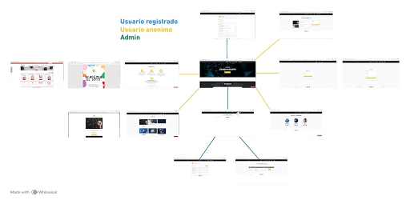

# [Academia El Soto]

## 👥 Miembros del Equipo
| Nombre y Apellidos | Correo URJC | Usuario GitHub |
|:--- |:--- |:--- |
| [Ignacio Enfedaque Cordero] | [i.enfedaque.2024]@alumnos.urjc.es | [IEC12] |
| [Mario Jándara Alcón] | [m.jandara.2024]@alumnos.urjc.es | [marioooooo20006] |
| [Max Albert Vintila Popescu] | [ma.vintila.2018]@alumnos.urjc.es | [MaxVintilaPop] |


---

## 🎭 **Preparación: Definición del Proyecto**

### **Descripción del Tema**
[Escribe aquí una descripción breve y concisa de qué trata tu aplicación, el sector al que pertenece y qué valor aporta al usuario].

### **Entidades**
Indicar las entidades principales que gestionará la aplicación y las relaciones entre ellas:

1. **[Entidad 1]**: Usuario
2. **[Entidad 2]**: Curso
3. **[Entidad 3]**: Carrito de compra
4. **[Entidad 4]**: Comentario
### **Relaciones entre entidades:**
- Usuario - Curso: Un usuario puede tener varios cursos y un curso tiene varios usuarios (N:M)
- Usuario - Comentario: Un alumno puede tener varios comentarios(1:N)
- Usuario - Carrito de compra: Un usuario tiene un carrito (1:1)
- Curso - Carrito de compra: Un carrito puede tener varios cursos (N:1)
- Curso - Comentario: Un curso puede tener varios comentarios (1:N)

### **Permisos de los Usuarios**
Describir los permisos de cada tipo de usuario e indicar de qué entidades es dueño:

* **Usuario Anónimo**: 
  - Permisos: [Visualización de catálogo, búsqueda de productos, registro]
  - No es dueño de ninguna entidad

* **Usuario Registrado**: 
  - Permisos: [Gestión de perfil, comprar cursos, crear comentarios]
  - Es dueño de: [Sus propios Cursos, su Perfil de Usuario, sus Comentarios, Carrito de Compra]

* **Administrador**: 
  - Permisos: [Gestión completa de productos (CRUD), visualización de estadísticas (alumnos y cursos), moderación de contenido]
  - Es dueño de: [Comentarios, Carrito de Compra, puede gestionar todos los Alumnos y Cursos]

### **Imágenes**
Indicar qué entidades tendrán asociadas una o varias imágenes:

- **[Entidad con imágenes 1]**: [Usuario - Una imagen de avatar por usuario]
- **[Entidad con imágenes 2]**: [Curso - Múltiples imágenes por producto (galería)]


---

## 🛠 **Práctica 1: Maquetación de páginas con HTML y CSS**

### **Vídeo de Demostración**
📹 **[Enlace al vídeo en YouTube](https://www.youtube.com/watch?v=zragO0G0m_4)**
> Vídeo mostrando las principales funcionalidades de la aplicación web.

### **Diagrama de Navegación**
Diagrama que muestra cómo se navega entre las diferentes páginas de la aplicación:



> El usuario puede acceder a cualquier elemento de la web desde la página principal (información, cursos, profesorado, carrito y login). Desde el apartado información puede acceder a un folleto creado por la academia y a la intranet de la propia URJC, para que así pueda consultar sus horarios, exámenes, etc.. Desde el apartado cursos puede acceder a una pequeña descripción de cada curso, que consta de un texto informativo, de un precio y del nombre del profesor que imparte la asignatura en la academia, así como su precio. Desde el login, si no se tiene una cuenta, se puede acceder a otra página  para registrar una cuenta nueva. En profesores se puede ver a los profesores y sus estudios, y en carrito el carrito de compra de la persona. Todas las páginas pueden relacionarse entre ellas. 

### **Capturas de Pantalla y Descripción de Páginas**

#### **1. Página Principal / Home**


> [Descripción breve: "Página de inicio de la Academia que incluye barra de navegación con acceso a información, cursos, profesores, login, administración y carrito. Además, incluye una sección de comentarios."]

#### **2. Información / Servicios**


> [Descripción breve: "Página de información de Academia El Soto que muestra la historia, logros, servicios, cursos especializados y enlaces útiles de la URJC. Incluye mapa, video, botón de contacto por correo y descarga de folleto, además de barra de navegación con acceso a cursos, profesores, login administración y carrito."]

#### **3. Cursos / Comentarios**


> [Descripción breve: "Página de cursos que muestra los cursos disponibles con imágenes, nombre, cuatrimestre y descripción. Incluye información de profesor, número mínimo de alumnos, precio, botón para comprar, botón de contacto por correo y barra de navegación con acceso al resto de botones."]


> [Descripción breve: "Además en cada curso el usuario registrado puede poner comentarios a cerca de cada curso."]

#### **4. Página Profesores**


> [Descripción breve: "Página de profesores de Academia El Soto que muestra al equipo docente con foto, nombre, especialidad. Incluye acceso al resto de botones."]

#### **5. Login**


> [Descripción breve: "Página de inicio de sesión de la Academia que permite a los usuarios registrados acceder a su cuenta mediante email y contraseña. Incluye enlace para registrarse si no tiene cuenta. Permite acceso al resto de botones."]

#### **6. Registro**


> [Descripción breve: "Página de registro de la Academia que permite a nuevos usuarios crear una cuenta proporcionando nombre completo, email y contraseña."]

#### **7. Perfil Usuario**


> [Descripción breve: "Página de perfil de usuario ya registrado que muestra información personal, cursos inscritos, comentarios realizados y opciones de configuración. Incluye edición y eliminación de comentarios, botones para editar perfil y cerrar sesión."]

#### **8. Admin**


> [Descripción breve: "Página visible para admin de la web que muestra un mensaje de bienvenida y guía sobre cómo acceder a las opciones de administración mediante el menú."]

#### **9. Admin / Estadísticas**


> [Descripción breve: "Página para administradores que muestra las estadísticas de los cursos, incluyendo nombre del curso, profesor, número de alumnos y facturación. Permite añadir, editar o eliminar cursos mediante botones de acción."]

#### **10. Admin / Creación Curso**


> [Descripción breve: "Página de administración para editar un curso, permitiendo modificar nombre, profesor, precio, imagen y descripción del curso."]

#### **11. Admin / Usuarios**


> [Descripción breve: "Página de admins que muestra los usuarios registrados, incluyendo nombre, email y número de cursos inscritos. Permite ver el perfil de cada usuario o eliminarlo."]

#### **12. Carrito**


> [Descripción breve: "Página de carrito de compras que muestra los cursos seleccionados por el usuario, incluyendo título, profesor, precio e imagen. Permite eliminar cursos individualmente y muestra un resumen con total de cursos y coste total, junto con un botón para finalizar la compra."]
### **Participación de Miembros en la Práctica 1**

#### **Alumno 1 - [Mario Jándara Alcón]**

[Sección información; Sección Admin/estadísticas. Descripción de capturas del Readme.]

| Nº    | Commits      | Files      |
|:------------: |:------------:| :------------:|
|1| [Página de información](https://github.com/DWS-2026/project-grupo-14/commit/45a41a59bc31d53cdad90bf46bb06e7be6756250)  | [información.html](startbootstrap-agency-gh-pages/index.html)   |
|2| [Página información](https://github.com/DWS-2026/project-grupo-14/commit/9d96119d35964ef81efd082f11032c585a4f9899)  | [infromación.html](startbootstrap-agency-gh-pages/index.html)   |
|3| [Cambios generales](https://github.com/DWS-2026/project-grupo-14/commit/86899abc26caf5fd26187b418287bb00f730e1a7)  | [información.html](practicDWS/informacion.html)   |
|4| [Admin/Estadíticas](https://github.com/DWS-2026/project-grupo-14/commit/3df5c67183a8475b50a96f0c88f70127bd59257c)  | [index.html](practicDWS/admin.html)   |
|5| [Readme Descripción Capturas](https://github.com/DWS-2026/project-grupo-14/commit/9fc5d8a7c3dc9d9f1f1ecadbd84414c72917c327)  | [Readme](README.md)   |

---

#### **Alumno 2 - [Ignacio Enfedaque Cordero]**

[Seccion profesorado, sección cursos, diseño del diagrama de navegación]

| Nº    | Commits      | Files      |
|:------------: |:------------:| :------------:|
|1| [Clase Team y clase Portfolio cambiadas a Profesorado y Cursos]((https://github.com/DWS-2026/project-grupo-14/commit/388ce8de1863f780d1bdffd17ce0cfb8330829d3))  | [index.html](startbootstrap-agency-gh-pages/index.html)   |
|2| [separación en paginas independientes]((https://github.com/DWS-2026/project-grupo-14/commit/e3602bd3f8a4f3ee127b67eea67b75b752f4d20e))  | [profesores.html](startbootstrap-agency-gh-pages/profesores.html)   |
|3| [Cambios en cursos e interacción entre paginas]((https://github.com/DWS-2026/project-grupo-14/commit/aa481cf8608dff0bc0547354ec6a9d639e97c24b))  | [cursos.html](startbootstrap-agency-gh-pages/cursos.html)   |
|4| [Añadido comentarios, editado informacion  y añadido clase carrito]((https://github.com/DWS-2026/project-grupo-14/commit/f344b2437e1d4defc7e8742dda156c6670021a64))  | [carrito.html](practicDWS/carrito.html)   |
|5| [Creación del Diagrama de navegacion]((https://github.com/DWS-2026/project-grupo-14/commit/002d77866084789895c240da0af9725052a981d4))  | [Diagrama.png](images/Diagrama.pngl)   |

---

#### **Alumno 3 - [Max Albert Vintila Popescu]**

[Páginas de login, register y perfil de user. Algunas funcionalidades de admin. Carrito. Video demostración]

| Nº    | Commits      | Files      |
|:------------: |:------------:| :------------:|
|1| [Página de login creada](https://github.com/DWS-2026/dws-2026-project-base/commit/f9aacb2566cbf7747dece563172058f57dea1aaa)  | [login.html](startbootstrap-agency-gh-pages/login.html)   |
|2| [Página de perfil](https://github.com/DWS-2026/dws-2026-project-base/commit/54180c4b56388e393db6fba1a03c7c84d76d42d2)  | [user.html](startbootstrap-agency-gh-pages/user.html)   |
|3| [Añadido ejemplo carrito](https://github.com/DWS-2026/dws-2026-project-base/commit/b6b10ee37fb2c0de9959c632a493fbbc2f126c3b)  | [carrito.html](practicDWS/carrito.html)   |
|4| [Añadida página para editar cursos y cambiado un poco la navegacion](https://github.com/DWS-2026/dws-2026-project-base/commit/285382c59a3c36c693294fc5d7e3951b72752ded)  | [admin_editar_curso.html](practicDWS/admin_editar_curso.html)   |
|5| [Añadida pagina para visualizar usuarios del admin](https://github.com/DWS-2026/dws-2026-project-base/commit/73e834c66a9c91dc472013a80a33d57261daaa88)  | [admin_users.html](practicDWS/admin_users.html)   |

---

## 🛠 **Práctica 2: Web con HTML generado en servidor**

### **Vídeo de Demostración**
📹 **[Enlace al vídeo en YouTube](https://www.youtube.com/watch?v=x91MPoITQ3I)**
> Vídeo mostrando las principales funcionalidades de la aplicación web.

### **Navegación y Capturas de Pantalla**

#### **Diagrama de Navegación**

Solo si ha cambiado.

#### **Capturas de Pantalla Actualizadas**

Solo si han cambiado.

### **Instrucciones de Ejecución**

#### **Requisitos Previos**
- **Java**: versión 21 o superior
- **Maven**: versión 3.8 o superior
- **MySQL**: versión 8.0 o superior
- **Git**: para clonar el repositorio

#### **Pasos para ejecutar la aplicación**

1. **Clonar el repositorio**
   ```bash
   git clone https://github.com/[usuario]/[nombre-repositorio].git
   cd [nombre-repositorio]
   ```

2. **AQUÍ INDICAR LO SIGUIENTES PASOS**

#### **Credenciales de prueba**
- **Usuario Admin**: usuario: `admin`, contraseña: `admin`
- **Usuario Registrado**: usuario: `user`, contraseña: `user`

### **Diagrama de Entidades de Base de Datos**

Diagrama mostrando las entidades, sus campos y relaciones:


> [Descripción opcional: Ej: "El diagrama muestra las 4 entidades principales: Usuario, Producto, Pedido y Categoría, con sus respectivos atributos y relaciones 1:N y N:M."]

### **Diagrama de Clases y Templates**

Diagrama de clases de la aplicación con diferenciación por colores o secciones:


> [Descripción opcional del diagrama y relaciones principales]

### **Participación de Miembros en la Práctica 2**

#### **Alumno 1 - [Nombre Completo]**

[Descripción de las tareas y responsabilidades principales del alumno en el proyecto]

| Nº    | Commits      | Files      |
|:------------: |:------------:| :------------:|
|1| [Descripción commit 1](URL_commit_1)  | [Archivo1](URL_archivo_1)   |
|2| [Descripción commit 2](URL_commit_2)  | [Archivo2](URL_archivo_2)   |
|3| [Descripción commit 3](URL_commit_3)  | [Archivo3](URL_archivo_3)   |
|4| [Descripción commit 4](URL_commit_4)  | [Archivo4](URL_archivo_4)   |
|5| [Descripción commit 5](URL_commit_5)  | [Archivo5](URL_archivo_5)   |

---

#### **Alumno 2 - [Nombre Completo]**

[Descripción de las tareas y responsabilidades principales del alumno en el proyecto]

| Nº    | Commits      | Files      |
|:------------: |:------------:| :------------:|
|1| [Descripción commit 1](URL_commit_1)  | [Archivo1](URL_archivo_1)   |
|2| [Descripción commit 2](URL_commit_2)  | [Archivo2](URL_archivo_2)   |
|3| [Descripción commit 3](URL_commit_3)  | [Archivo3](URL_archivo_3)   |
|4| [Descripción commit 4](URL_commit_4)  | [Archivo4](URL_archivo_4)   |
|5| [Descripción commit 5](URL_commit_5)  | [Archivo5](URL_archivo_5)   |

---

#### **Alumno 3 - [Nombre Completo]**

[Descripción de las tareas y responsabilidades principales del alumno en el proyecto]

| Nº    | Commits      | Files      |
|:------------: |:------------:| :------------:|
|1| [Descripción commit 1](URL_commit_1)  | [Archivo1](URL_archivo_1)   |
|2| [Descripción commit 2](URL_commit_2)  | [Archivo2](URL_archivo_2)   |
|3| [Descripción commit 3](URL_commit_3)  | [Archivo3](URL_archivo_3)   |
|4| [Descripción commit 4](URL_commit_4)  | [Archivo4](URL_archivo_4)   |
|5| [Descripción commit 5](URL_commit_5)  | [Archivo5](URL_archivo_5)   |

---

#### **Alumno 4 - [Nombre Completo]**

[Descripción de las tareas y responsabilidades principales del alumno en el proyecto]

| Nº    | Commits      | Files      |
|:------------: |:------------:| :------------:|
|1| [Descripción commit 1](URL_commit_1)  | [Archivo1](URL_archivo_1)   |
|2| [Descripción commit 2](URL_commit_2)  | [Archivo2](URL_archivo_2)   |
|3| [Descripción commit 3](URL_commit_3)  | [Archivo3](URL_archivo_3)   |
|4| [Descripción commit 4](URL_commit_4)  | [Archivo4](URL_archivo_4)   |
|5| [Descripción commit 5](URL_commit_5)  | [Archivo5](URL_archivo_5)   |

---

## 🛠 **Práctica 3: Incorporación de una API REST a la aplicación web, análisis de vulnerabilidades y contramedidas**

### **Vídeo de Demostración**
📹 **[Enlace al vídeo en YouTube](https://www.youtube.com/watch?v=x91MPoITQ3I)**
> Vídeo mostrando las principales funcionalidades de la aplicación web.

### **Documentación de la API REST**

#### **Especificación OpenAPI**
📄 **[Especificación OpenAPI (YAML)](/api-docs/api-docs.yaml)**

#### **Documentación HTML**
📖 **[Documentación API REST (HTML)](https://raw.githack.com/[usuario]/[repositorio]/main/api-docs/api-docs.html)**

> La documentación de la API REST se encuentra en la carpeta `/api-docs` del repositorio. Se ha generado automáticamente con SpringDoc a partir de las anotaciones en el código Java.

### **Diagrama de Clases y Templates Actualizado**

Diagrama actualizado incluyendo los @RestController y su relación con los @Service compartidos:


#### **Credenciales de Usuarios de Ejemplo**

| Rol | Usuario | Contraseña |
|:---|:---|:---|
| Administrador | admin | admin123 |
| Usuario Registrado | user1 | user123 |
| Usuario Registrado | user2 | user123 |

### **Participación de Miembros en la Práctica 3**

#### **Alumno 1 - [Nombre Completo]**

[Descripción de las tareas y responsabilidades principales del alumno en el proyecto]

| Nº    | Commits      | Files      |
|:------------: |:------------:| :------------:|
|1| [Descripción commit 1](URL_commit_1)  | [Archivo1](URL_archivo_1)   |
|2| [Descripción commit 2](URL_commit_2)  | [Archivo2](URL_archivo_2)   |
|3| [Descripción commit 3](URL_commit_3)  | [Archivo3](URL_archivo_3)   |
|4| [Descripción commit 4](URL_commit_4)  | [Archivo4](URL_archivo_4)   |
|5| [Descripción commit 5](URL_commit_5)  | [Archivo5](URL_archivo_5)   |

---

#### **Alumno 2 - [Nombre Completo]**

[Descripción de las tareas y responsabilidades principales del alumno en el proyecto]

| Nº    | Commits      | Files      |
|:------------: |:------------:| :------------:|
|1| [Descripción commit 1](URL_commit_1)  | [Archivo1](URL_archivo_1)   |
|2| [Descripción commit 2](URL_commit_2)  | [Archivo2](URL_archivo_2)   |
|3| [Descripción commit 3](URL_commit_3)  | [Archivo3](URL_archivo_3)   |
|4| [Descripción commit 4](URL_commit_4)  | [Archivo4](URL_archivo_4)   |
|5| [Descripción commit 5](URL_commit_5)  | [Archivo5](URL_archivo_5)   |

---

#### **Alumno 3 - [Nombre Completo]**

[Descripción de las tareas y responsabilidades principales del alumno en el proyecto]

| Nº    | Commits      | Files      |
|:------------: |:------------:| :------------:|
|1| [Descripción commit 1](URL_commit_1)  | [Archivo1](URL_archivo_1)   |
|2| [Descripción commit 2](URL_commit_2)  | [Archivo2](URL_archivo_2)   |
|3| [Descripción commit 3](URL_commit_3)  | [Archivo3](URL_archivo_3)   |
|4| [Descripción commit 4](URL_commit_4)  | [Archivo4](URL_archivo_4)   |
|5| [Descripción commit 5](URL_commit_5)  | [Archivo5](URL_archivo_5)   |

---

#### **Alumno 4 - [Nombre Completo]**

[Descripción de las tareas y responsabilidades principales del alumno en el proyecto]

| Nº    | Commits      | Files      |
|:------------: |:------------:| :------------:|
|1| [Descripción commit 1](URL_commit_1)  | [Archivo1](URL_archivo_1)   |
|2| [Descripción commit 2](URL_commit_2)  | [Archivo2](URL_archivo_2)   |
|3| [Descripción commit 3](URL_commit_3)  | [Archivo3](URL_archivo_3)   |
|4| [Descripción commit 4](URL_commit_4)  | [Archivo4](URL_archivo_4)   |
|5| [Descripción commit 5](URL_commit_5)  | [Archivo5](URL_archivo_5)   |
