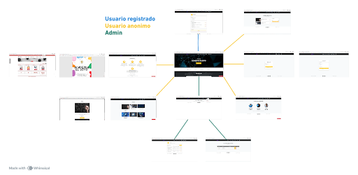
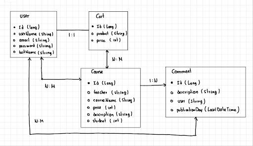
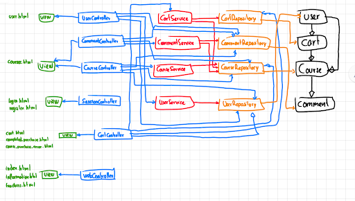
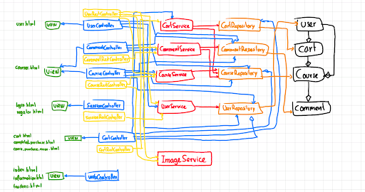

# [Academia El Soto]

## 👥 Miembros del Equipo
| Nombre y Apellidos | Correo URJC | Usuario GitHub |
|:--- |:--- |:--- |
| [Ignacio Enfedaque Cordero] | [i.enfedaque.2024]@alumnos.urjc.es | [IEC12] |
| [Mario Jándara Alcón] | [m.jandara.2024]@alumnos.urjc.es | [marioooooo20006] |
| [Max Albert Vintila Popescu] | [ma.vintila.2018]@alumnos.urjc.es | [MaxVintilaPop] |


---

## 🎭 **Preparación: Definición del Proyecto**

### **Descripción del Tema**
[Escribe aquí una descripción breve y concisa de qué trata tu aplicación, el sector al que pertenece y qué valor aporta al usuario].

### **Entidades**
Indicar las entidades principales que gestionará la aplicación y las relaciones entre ellas:

1. **[Entidad 1]**: Usuario
2. **[Entidad 2]**: Curso
3. **[Entidad 3]**: Carrito de compra
4. **[Entidad 4]**: Comentario
### **Relaciones entre entidades:**
- Usuario - Curso: Un usuario puede tener varios cursos y un curso tiene varios usuarios (N:M)
- Usuario - Comentario: Un alumno puede tener varios comentarios(1:N)
- Usuario - Carrito de compra: Un usuario tiene un carrito (1:1)
- Curso - Carrito de compra: Un carrito puede tener varios cursos (N:1)
- Curso - Comentario: Un curso puede tener varios comentarios (1:N)

### **Permisos de los Usuarios**
Describir los permisos de cada tipo de usuario e indicar de qué entidades es dueño:

* **Usuario Anónimo**: 
  - Permisos: [Visualización de catálogo, búsqueda de productos, registro]
  - No es dueño de ninguna entidad

* **Usuario Registrado**: 
  - Permisos: [Gestión de perfil, comprar cursos, crear comentarios]
  - Es dueño de: [Sus propios Cursos, su Perfil de Usuario, sus Comentarios, Carrito de Compra]

* **Administrador**: 
  - Permisos: [Gestión completa de productos (CRUD), visualización de estadísticas (alumnos y cursos), moderación de contenido]
  - Es dueño de: [Comentarios, Carrito de Compra, puede gestionar todos los Alumnos y Cursos]

### **Imágenes**
Indicar qué entidades tendrán asociadas una o varias imágenes:

- **[Entidad con imágenes 1]**: [Usuario - Una imagen de avatar por usuario]
- **[Entidad con imágenes 2]**: [Curso - Múltiples imágenes por producto (galería)]


---

## 🛠 **Práctica 1: Maquetación de páginas con HTML y CSS**

### **Vídeo de Demostración**
📹 **[Enlace al vídeo en YouTube](https://www.youtube.com/watch?v=zragO0G0m_4)**
> Vídeo mostrando las principales funcionalidades de la aplicación web.

### **Diagrama de Navegación**
Diagrama que muestra cómo se navega entre las diferentes páginas de la aplicación:



> El usuario puede acceder a cualquier elemento de la web desde la página principal (información, cursos, profesorado, carrito y login). Desde el apartado información puede acceder a un folleto creado por la academia y a la intranet de la propia URJC, para que así pueda consultar sus horarios, exámenes, etc.. Desde el apartado cursos puede acceder a una pequeña descripción de cada curso, que consta de un texto informativo, de un precio y del nombre del profesor que imparte la asignatura en la academia, así como su precio. Desde el login, si no se tiene una cuenta, se puede acceder a otra página  para registrar una cuenta nueva. En profesores se puede ver a los profesores y sus estudios, y en carrito el carrito de compra de la persona. Todas las páginas pueden relacionarse entre ellas. 

### **Capturas de Pantalla y Descripción de Páginas**

#### **1. Página Principal / Home**


> [Descripción breve: "Página de inicio de la Academia que incluye barra de navegación con acceso a información, cursos, profesores, login, administración y carrito. Además, incluye una sección de comentarios."]

#### **2. Información / Servicios**


> [Descripción breve: "Página de información de Academia El Soto que muestra la historia, logros, servicios, cursos especializados y enlaces útiles de la URJC. Incluye mapa, video, botón de contacto por correo y descarga de folleto, además de barra de navegación con acceso a cursos, profesores, login administración y carrito."]

#### **3. Cursos / Comentarios**


> [Descripción breve: "Página de cursos que muestra los cursos disponibles con imágenes, nombre, cuatrimestre y descripción. Incluye información de profesor, número mínimo de alumnos, precio, botón para comprar, botón de contacto por correo y barra de navegación con acceso al resto de botones."]


> [Descripción breve: "Además en cada curso el usuario registrado puede poner comentarios a cerca de cada curso."]

#### **4. Página Profesores**


> [Descripción breve: "Página de profesores de Academia El Soto que muestra al equipo docente con foto, nombre, especialidad. Incluye acceso al resto de botones."]

#### **5. Login**


> [Descripción breve: "Página de inicio de sesión de la Academia que permite a los usuarios registrados acceder a su cuenta mediante email y contraseña. Incluye enlace para registrarse si no tiene cuenta. Permite acceso al resto de botones."]

#### **6. Registro**


> [Descripción breve: "Página de registro de la Academia que permite a nuevos usuarios crear una cuenta proporcionando nombre completo, email y contraseña."]

#### **7. Perfil Usuario**


> [Descripción breve: "Página de perfil de usuario ya registrado que muestra información personal, cursos inscritos, comentarios realizados y opciones de configuración. Incluye edición y eliminación de comentarios, botones para editar perfil y cerrar sesión."]

#### **8. Admin**


> [Descripción breve: "Página visible para admin de la web que muestra un mensaje de bienvenida y guía sobre cómo acceder a las opciones de administración mediante el menú."]

#### **9. Admin / Estadísticas**


> [Descripción breve: "Página para administradores que muestra las estadísticas de los cursos, incluyendo nombre del curso, profesor, número de alumnos y facturación. Permite añadir, editar o eliminar cursos mediante botones de acción."]

#### **10. Admin / Creación Curso**


> [Descripción breve: "Página de administración para editar un curso, permitiendo modificar nombre, profesor, precio, imagen y descripción del curso."]

#### **11. Admin / Usuarios**


> [Descripción breve: "Página de admins que muestra los usuarios registrados, incluyendo nombre, email y número de cursos inscritos. Permite ver el perfil de cada usuario o eliminarlo."]

#### **12. Carrito**


> [Descripción breve: "Página de carrito de compras que muestra los cursos seleccionados por el usuario, incluyendo título, profesor, precio e imagen. Permite eliminar cursos individualmente y muestra un resumen con total de cursos y coste total, junto con un botón para finalizar la compra."]
### **Participación de Miembros en la Práctica 1**

#### **Alumno 1 - [Mario Jándara Alcón]**

[Sección información; Sección Admin/estadísticas. Descripción de capturas del Readme.]

| Nº    | Commits      | Files      |
|:------------: |:------------:| :------------:|
|1| [Página de información](https://github.com/DWS-2026/project-grupo-14/commit/45a41a59bc31d53cdad90bf46bb06e7be6756250)  | [información.html](startbootstrap-agency-gh-pages/index.html)   |
|2| [Página información](https://github.com/DWS-2026/project-grupo-14/commit/9d96119d35964ef81efd082f11032c585a4f9899)  | [infromación.html](startbootstrap-agency-gh-pages/index.html)   |
|3| [Cambios generales](https://github.com/DWS-2026/project-grupo-14/commit/86899abc26caf5fd26187b418287bb00f730e1a7)  | [información.html](practicDWS/informacion.html)   |
|4| [Admin/Estadíticas](https://github.com/DWS-2026/project-grupo-14/commit/3df5c67183a8475b50a96f0c88f70127bd59257c)  | [index.html](practicDWS/admin.html)   |
|5| [Readme Descripción Capturas](https://github.com/DWS-2026/project-grupo-14/commit/9fc5d8a7c3dc9d9f1f1ecadbd84414c72917c327)  | [Readme](README.md)   |

---

#### **Alumno 2 - [Ignacio Enfedaque Cordero]**

[Seccion profesorado, sección cursos, diseño del diagrama de navegación]

| Nº    | Commits      | Files      |
|:------------: |:------------:| :------------:|
|1| [Clase Team y clase Portfolio cambiadas a Profesorado y Cursos](https://github.com/DWS-2026/project-grupo-14/commit/388ce8de1863f780d1bdffd17ce0cfb8330829d3)  | [index.html](startbootstrap-agency-gh-pages/index.html)   |
|2| [separación en paginas independientes](https://github.com/DWS-2026/project-grupo-14/commit/e3602bd3f8a4f3ee127b67eea67b75b752f4d20e)  | [profesores.html](startbootstrap-agency-gh-pages/profesores.html)   |
|3| [Cambios en cursos e interacción entre paginas](https://github.com/DWS-2026/project-grupo-14/commit/aa481cf8608dff0bc0547354ec6a9d639e97c24b) | [cursos.html](startbootstrap-agency-gh-pages/cursos.html)   |
|4| [Añadido comentarios, editado informacion  y añadido clase carrito](https://github.com/DWS-2026/project-grupo-14/commit/f344b2437e1d4defc7e8742dda156c6670021a64)  | [carrito.html](practicDWS/carrito.html)   |
|5| [Creación del Diagrama de navegacion](https://github.com/DWS-2026/project-grupo-14/commit/002d77866084789895c240da0af9725052a981d4)  | [Diagrama.png](images/Diagrama.pngl)   |

---

#### **Alumno 3 - [Max Albert Vintila Popescu]**

[Páginas de login, register y perfil de user. Algunas funcionalidades de admin. Carrito. Video demostración]

| Nº    | Commits      | Files      |
|:------------: |:------------:| :------------:|
|1| [Página de login creada](https://github.com/DWS-2026/dws-2026-project-base/commit/f9aacb2566cbf7747dece563172058f57dea1aaa)  | [login.html](startbootstrap-agency-gh-pages/login.html)   |
|2| [Página de perfil](https://github.com/DWS-2026/dws-2026-project-base/commit/54180c4b56388e393db6fba1a03c7c84d76d42d2)  | [user.html](startbootstrap-agency-gh-pages/user.html)   |
|3| [Añadido ejemplo carrito](https://github.com/DWS-2026/dws-2026-project-base/commit/b6b10ee37fb2c0de9959c632a493fbbc2f126c3b)  | [carrito.html](practicDWS/carrito.html)   |
|4| [Añadida página para editar cursos y cambiado un poco la navegacion](https://github.com/DWS-2026/dws-2026-project-base/commit/285382c59a3c36c693294fc5d7e3951b72752ded)  | [admin_editar_curso.html](practicDWS/admin_editar_curso.html)   |
|5| [Añadida pagina para visualizar usuarios del admin](https://github.com/DWS-2026/dws-2026-project-base/commit/73e834c66a9c91dc472013a80a33d57261daaa88)  | [admin_users.html](practicDWS/admin_users.html)   |

---

## 🛠 **Práctica 2: Web con HTML generado en servidor**

### **Vídeo de Demostración**
📹 **[Enlace al vídeo en YouTube](https://www.youtube.com/watch?v=x9OMwpKrzvs)**
> Vídeo mostrando las principales funcionalidades de la aplicación web.

### **Navegación y Capturas de Pantalla**

#### **Diagrama de Navegación**

Solo si ha cambiado.

#### **Capturas de Pantalla Actualizadas**

Solo si han cambiado.

### **Instrucciones de Ejecución**

#### **Requisitos Previos**
- **Java**: versión 21 o superior
- **Maven**: versión 3.8 o superior
- **MySQL**: versión 8.0 o superior
- **Git**: para clonar el repositorio

#### **Pasos para ejecutar la aplicación**

1. **Clonar el repositorio**
   ```bash
   git clone https://github.com/[usuario]/[nombre-repositorio].git
   cd [nombre-repositorio]
   ```
   
2. **Comprobar los requisitos previos**  
  Es necesario tener instalado Java 21, Maven y MySQL 8 (o superior).

3. **Crear la base de datos en MySQL**
  El proyecto utiliza una base de datos llamada academia_elsoto, por lo que debes crearla antes de ejecutar la aplicación:
  ```bash
  CREATE DATABASE academia_elsoto;
  ```
   
4. **Configurar la conexión a la base de datos**
  En el archivo src/main/resources/application.properties se encuentra la configuración de la base de datos. Por defecto es:
  spring.datasource.url=jdbc:mysql://localhost:3306/academia_elsoto?useSSL=false&allowPublicKeyRetrieval=true&serverTimezone=UTC
  spring.datasource.username=root
  spring.datasource.password=MIM_DATABASE
  Si tu usuario o contraseña de MySQL son diferentes, debes modificarlos en este archivo.

5. **Instalar dependencias y compilar el proyecto**
  Desde la raíz del proyecto, ejecutar:
  ```bash
  mvn clean install
  ```

6. **Ejecutar la aplicación**
  Puedes ejecutarlo desde tu IDE lanzando la clase principal AcademiaElSotoApplication.java.

7. **Acceder a la aplicación**
  La aplicación funciona con HTTPS en el puerto 8443, por lo que debes abrir en el navegador:
  https://localhost:8443
  Es posible que el navegador muestre una advertencia de seguridad. En ese caso, acepta continuar.

#### **Credenciales de prueba**
- **Usuario Admin**: usuario: `admin`, contraseña: `adminpass`
- **Usuario Registrado**: usuario: `user`, contraseña: `pass`

### **Diagrama de Entidades de Base de Datos**

Diagrama mostrando las entidades, sus campos y relaciones:




### **Diagrama de Clases y Templates**

Diagrama de clases de la aplicación con diferenciación por colores o secciones:




### **Participación de Miembros en la Práctica 2**

#### **Alumno 1 - [Mario Jándara Alcón]**

[Principalmente: Entidad Curso , Seguridad]

| Nº    | Commits      | Files      |
|:------------: |:------------:| :------------:|
|1| [https avance]([URL_commit_1](https://github.com/DWS-2026/project-grupo-14/commit/2dd09cca08a89d35aaa16a1034b80ca69c2fecc7))  | [SecurityConfiguration](practicaDWS/SecurityConfiguration.java)   |
|2| [Avance CSRF, etc]([URL_commit_2](https://github.com/DWS-2026/project-grupo-14/commit/d37e9a2b576e254dd3a60d22c9e6c0ef10921976))  | [CSRFHandlerConfiguration](practicaDWS/CSRFHandlerConfiguration.java)   |
|3| [Entidad curso]([URL_commit_3](https://github.com/DWS-2026/project-grupo-14/commit/4dd56715589eb7fff4fc42a0a36c39bf20bf7890))  | [CourseController]([URL_archivo_3](practicaDWS/CourseController.java))   |
|4| [Cargar y Editar imagenes]([URL_commit_4](https://github.com/DWS-2026/project-grupo-14/commit/4a9215db89aa3136d477456e9189e8a0d01fec8b))  | [CourseController](practicaDWS/CourseController.java)   |
|5| [Ayuda en User]([URL_commit_5](https://github.com/DWS-2026/project-grupo-14/commit/aa0f955a6bfcf018fc7e219cd9923eca7316dcc6))  | [UserController](practicaDWS/UserController.java)   |

---

#### **Alumno 2 - [Ignacio Enfedaque Cordero]**

[Principalmente entidad carrito, https de curso y demas entidades para enseñar lo que existe en la base de datos]

| Nº    | Commits      | Files      |
|:------------: |:------------:| :------------:|
|1| [Cursos y avance en boton para añadir a carrito](https://github.com/DWS-2026/project-grupo-14/commit/fec1d3540458143fb0d6f1f9a53335b1c8d1bd72) | [CourseController.java](src/main/java/es/codeurjc/AcademiaElSoto/controller/CourseController.java)   |
|2| [carrito y cursos](https://github.com/DWS-2026/project-grupo-14/commit/d0f93696ec405e51b6700acf6584a0bc4a616304#diff-60911d0c65668087943f99bccd81c3d3009a157539f3a77fa4a593357cbbe087)  | [CommentController.java](src/main/java/es/codeurjc/AcademiaElSoto/controller/CommentController.java)   |
|3| [Admin editar cursos tabla](https://github.com/DWS-2026/project-grupo-14/commit/6b837de87332a982ce8e6d50d9318481b1c171c3) | [admin_estadisticas.html](src/main/resources/templates/admin_estadisticas.html)   |
|4| [Registro de usuario](https://github.com/DWS-2026/project-grupo-14/commit/f4bbd75cebc862351cdae4c5af1e29d21a36ce19) | [UserController.java](src/main/java/es/codeurjc/AcademiaElSoto/controller/UserController.java)   |
|5| [Perfil de usuario](https://github.com/DWS-2026/project-grupo-14/commit/e0347a11a686a7f408384a52366e2b0fa67986df)  | [UserController.java](src/main/java/es/codeurjc/AcademiaElSoto/controller/UserController.java)   |

---

#### **Alumno 3 - [Max Albert Vintila Popescu]**

[Princupalmente entidad comentario y partes de user y carrito. Algunas partes de seguridad y navegación]

| Nº    | Commits      | Files      |
|:------------: |:------------:| :------------:|
|1| [Add comment for each course](https://github.com/DWS-2026/dws-2026-project-base/commit/fe86482f19deca9cdfd5bf4ff7c8e2ed45f2ae11)  | [CommentController](src/main/java/es/codeurjc/AcademiaElSoto/controller/CommentController.java)   |
|2| [Added users list for admin and working shopping cart](https://github.com/DWS-2026/dws-2026-project-base/commit/d0f0d1aba3cf07312e518de87ccb656aca0bb7f7)  | [CartController](src/main/java/es/codeurjc/AcademiaElSoto/controller/CartController.java)   |
|3| [Fixed cart and added header and footer partials that change with sessions](https://github.com/DWS-2026/dws-2026-project-base/commit/f4d1182ec2964be05abb62061a12a16ce43bc94f)  | [header.html](src/main/resources/templates/partials/header.html)   |
|4| [added pages for 403, 500 and generic errors](https://github.com/DWS-2026/dws-2026-project-base/commit/14c3035d78a0861249d8403383cf3b6a7b626dca)  | [error.html](src/main/resources/templates/error.html)   |
|5| [Fixed broken links and entity management](https://github.com/DWS-2026/dws-2026-project-base/commit/6c114519f76d0f95630fdb70eb8972b5faa93bac)  | [SecurityConfiguration.java](src/main/java/es/codeurjc/AcademiaElSoto/Security/SecurityConfiguration.java)   |

---

## 🛠 **Práctica 3: Incorporación de una API REST a la aplicación web, análisis de vulnerabilidades y contramedidas**

### **Vídeo de Demostración**
📹 **[Enlace al vídeo en YouTube](https://youtu.be/dBEqLrwv1bQ)**
> Vídeo mostrando las principales funcionalidades de la aplicación web.

### **Documentación de la API REST**

#### **Especificación OpenAPI**
📄 **[Especificación OpenAPI (YAML)](/api-docs/api-docs.yaml)**

#### **Documentación HTML**
📖 **[Documentación API REST (HTML)](https://raw.githack.com/DWS-2026/project-grupo-14/main/api-docs/api-docs.html)**

> La documentación de la API REST se encuentra en la carpeta `/api-docs` del repositorio. Se ha generado automáticamente con SpringDoc a partir de las anotaciones en el código Java.

### **Diagrama de Clases y Templates Actualizado**

Diagrama actualizado incluyendo los @RestController y su relación con los @Service compartidos:



#### **Credenciales de Usuarios de Ejemplo**

| Rol | Usuario | Contraseña |
|:---|:---|:---|
| Administrador | admin | adminpass |
| Usuario Registrado | user | pass |

### **Participación de Miembros en la Práctica 3**

#### **Alumno 1 - [Mario Jándara Alcón]**

[Principalmentep parte de la defensa ante vulnerabilidades OWASP TOP 10 y algunos ejemplos del temario]

| Nº    | Commits      | Files      |
|:------------: |:------------:| :------------:|
|1| [Texto enriquecido]([URL_commit_1](https://github.com/DWS-2026/project-grupo-14/commit/639e7a4bcccbba9b779d1eaed6aaa83251d35e2d))  | [edit_comment_page](src/main/resources/templates/comment_db/edit_comment_page.html)   |
|2| [Ejem 10/11]([URL_commit_2](https://github.com/DWS-2026/project-grupo-14/commit/73d50ae08f4d78abc4070619893a6b4548d5f654))  | [CartMapper](src/main/java/es/codeurjc/AcademiaElSoto/mapper/CartMapper.java)   |
|3| [Security Misconfiguration]([URL_commit_3](https://github.com/DWS-2026/project-grupo-14/commit/96523d0d0f4d1e63c6f2da36e2110618a9b5de9a))  | [CartController](src/main/java/es/codeurjc/AcademiaElSoto/controller/CartController.java)   |
|4| [Defense in depth]([URL_commit_4](https://github.com/DWS-2026/project-grupo-14/commit/79c94bbc0da762f9d3a0a88d0b587665f041e2ee))  | [CommentRestController](src/main/java/es/codeurjc/AcademiaElSoto/restcontroller/CommentRestController.java)   |
|5| [Authentication Failures]([URL_commit_5](https://github.com/DWS-2026/project-grupo-14/commit/62545c322a5c0453eb8cdce6583cd50cd0291382))  | [AuthetnticationEvents](src/main/java/es/codeurjc/AcademiaElSoto/Security/AuthenticationEvents.java)   |

---

#### **Alumno 2 - [Ignacio Enfedaque Cordero]**

[Principalmente la defensa ante algunas de las vulnerabilidades de la OWASP TOP 10]

| Nº    | Commits      | Files      |
|:------------: |:------------:| :------------:|
|1| [Broken Access Control](https://github.com/DWS-2026/project-grupo-14/commit/b5aa2f14eb927c9a013b5b33a00714c68d9db18e)  | [UserRestController](src/main/java/es/codeurjc/AcademiaElSoto/restcontroller/UserRestController.java)   |
|2| [Mishandling of Exceptional Conditions](https://github.com/DWS-2026/project-grupo-14/commit/ea3cc2005fc28445388e90ccab94d3f2f74dd5e8)  | [DatabaseUsersLoader](src/main/java/es/codeurjc/AcademiaElSoto/Security/DatabaseUsersLoader.java)   |
|3| [Cryptographic Failures](https://github.com/DWS-2026/project-grupo-14/commit/9b93dd25e2d98a8f9fa1835eadbe7785bfcd533a)  | [aplication.properties](src/main/resources/application.properties)   |
|4| [XSRF](https://github.com/DWS-2026/project-grupo-14/commit/c2bffd34ba3708005f30a9617f1a66e4f7847146)  | [CSRFHandlerConfiguration](src/main/java/es/codeurjc/AcademiaElSoto/Security/CSRFHandlerConfiguration.java)   |
|5| [Security Logging & Alerting Failures && Software or Data Integrity Failures](https://github.com/DWS-2026/project-grupo-14/commit/84c87af72052dc557127ef8710677b1a46a49ee3)  | [CourseController](src/main/java/es/codeurjc/AcademiaElSoto/controller/CourseController.java)   |

---

#### **Alumno 3 - [Max Albert Vintila Popescu]**

[Principalmente la API de las entidades y mitigación de vulnerabilidades de tipo inyección]

| Nº    | Commits      | Files      |
|:------------: |:------------:| :------------:|
|1| [Added REST for comments](https://github.com/DWS-2026/dws-2026-project-base/commit/de6cc8acc10901f5f0e4a95203c1c4ac2dfc9895)  | [CommentRestController](src/main/java/es/codeurjc/AcademiaElSoto/restcontroller/CommentRestController.java)   |
|2| [Added REST for Courses](https://github.com/DWS-2026/dws-2026-project-base/commit/f9c62073a21ebce8e98496e703fe432501d195f3)  | [CourseRestController](src/main/java/es/codeurjc/AcademiaElSoto/restcontroller/CourseRestController.java)   |
|3| [Reinforced course REST security](https://github.com/DWS-2026/dws-2026-project-base/commit/1962382b59ab074416c533b7716400fa09bbb859)  | [CourseRestController](src/main/java/es/codeurjc/AcademiaElSoto/restcontroller/CourseRestController.java)   |
|4| [Mitigated XSS](https://github.com/DWS-2026/dws-2026-project-base/commit/de822c21c10f29b890589d6e9faaf76e4c93fb30)  | [HtmlSanitizerService.java](src/main/java/es/codeurjc/AcademiaElSoto/service/HtmlSanitizerService.java)   |
|5| [Path Traversal](https://github.com/DWS-2026/dws-2026-project-base/commit/d0b7542c12bbae7f1fb1cbb2996e294d5762a7b0)  | [ImageService.java](src/main/java/es/codeurjc/AcademiaElSoto/service/ImageService.java)   |
